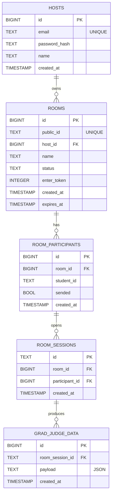

```mermaid
erDiagram

  HOSTS {
    BIGINT id PK
    TEXT email "UNIQUE"
    TEXT password_hash
    TEXT name
    TIMESTAMP created_at
  }

  ROOMS {
    BIGINT id PK
    TEXT public_id "UNIQUE"
    BIGINT host_id FK
    TEXT name
    TEXT status
    INTEGER enter_token 
    TIMESTAMP created_at
    TIMESTAMP expires_at
  }

  ROOM_PARTICIPANTS {
    BIGINT id PK
    BIGINT room_id FK
    TEXT student_id
    BOOL sended
    TIMESTAMP created_at
  }

  ROOM_SESSIONS {
    TEXT id PK
    BIGINT room_id FK
    BIGINT participant_id FK
    TIMESTAMP created_at
  }

  GRAD_JUDGE_DATA {
    BIGINT id PK
    TEXT room_session_id FK
    TEXT payload "JSON"
    TIMESTAMP created_at
  }

  HOSTS ||--o{ ROOMS : owns
  ROOMS ||--o{ ROOM_PARTICIPANTS : has
  ROOM_PARTICIPANTS ||--o{ ROOM_SESSIONS : opens
  ROOM_SESSIONS ||--o{ GRAD_JUDGE_DATA : produces


```
